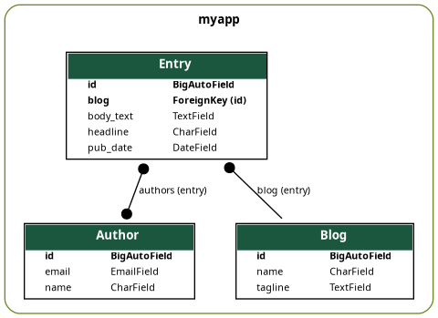
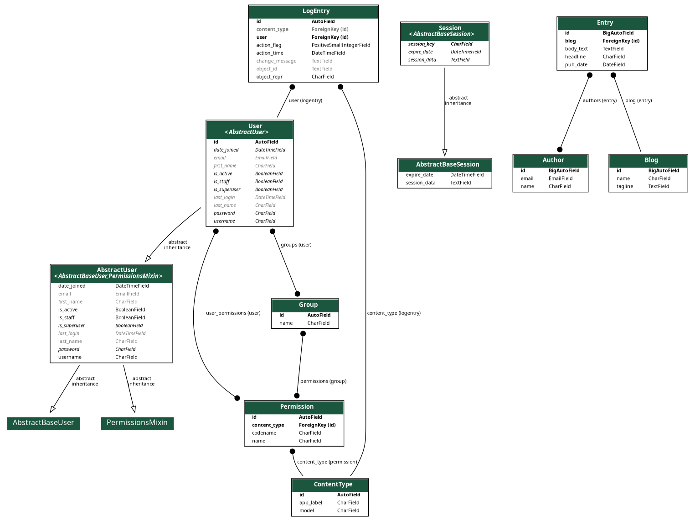
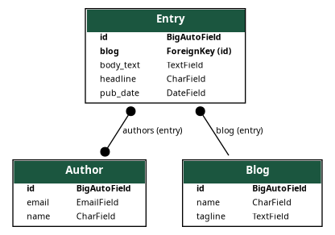

Graph models
============

:synopsis: Renders a graphical overview of your project or specified apps.

Creates a GraphViz_ dot file for the specified app names based on their models.py.
You can pass multiple app names and they will all be combined into a single model.
Output is usually directed to a dot file.

Several options are available: grouping models, including inheritance,
excluding models and columns, and changing the layout when rendering to an output
image.

With the latest revisions it's also possible to specify an output file if
pygraphviz_ is installed and render directly to an image or other supported
file-type.

Selecting a library
-------------------

You need to select the library to generate the image. You can do so by passing
the --pygraphviz or --pydot parameter, depending on which library you want to use.

When neither of the command line parameters are given the default is to try and load
pygraphviz or pydot (in that order) to generate the image.

To install pygraphviz you usually need to run this command::

  $ pip install pygraphviz

It is possible you can't install it because it needs some C extensions to build. In
that case you can try other methods to install or you can use PyDot.

To install pydot you need to run this command::

  $ pip install pyparsing pydot

Installation should be fast and easy. Remember to install this exact version of
pyparsing, otherwise it's possible you get this error:

    Couldn't import dot_parser, loading of dot files will not be possible.

Default Settings
----------------

The option GRAPH_MODELS = {} can be used in the settings file to specify default options::

  GRAPH_MODELS = {
    'all_applications': True,
    'group_models': True,
  }

It uses the same names as on the command line only with the leading two dashes removed and
the other dashes replaced by underscores. You can specify a list of applications with the *app_labels* key::

  GRAPH_MODELS = {
    'app_labels': ["myapp1", "myapp2", "auth"],
  }

Templates
---------

Django templates are used to generate the dot code. This in turn can be drawn into a image
by libraries like *pygraphviz* or *pydot*. You can extend or override the templates if needed.

Templates used:

- django_extensions/graph_models/digraph.dot
- django_extensions/graph_models/label.dot
- django_extensions/graph_models/relation.dot

Documentation on how to create dot files can be found here: https://www.graphviz.org/documentation/

.. warning::
  Modifying Django's default templates behaviour might break *graph_models*

  Please be aware that if you use any *template_loaders* or extensions that change the
  way templates are rendered that this can cause *graph_models* to fail.

  An example of this is
  the Django app *django-template-minifier* this automatically removed the newlines before/after
  template tags even for non-HTML templates which leads to a malformed file.

App-based Styling
-----------------

You can style models by app to visually distinguish them in the generated graph. This is useful when working with multiple apps that have interrelated models.

To use this feature, provide a JSON file specifying styles for each app. You can either:

- Place a `.app-style.json` file in the project root, or
- Use the `--app-style` command line option to specify a path to the file::

  $ ./manage.py graph_models -a --app-style path/to/style.json -o styled_output.png

The JSON file should map app labels to style dictionaries. The app labels can be exact matches or use wildcards (e.g., `django.*`) where the last entry wins.
For example:

.. code-block:: json

    {
      "app1": {"bg": "#341b56"},
      "app2": {"bg": "#1b3956"},
      "django.*": {"bg": "#561b4c"},
      "django.contrib.auth": {"bg": "#c41e3a"}
    }

Currently, the supported style option is `bg` (background color), but the system is designed to be extended in the future with support for additional styling such as font, shape, or border.
*Note: help is wanted to update themes to support more style options*

This feature allows you to generate a single graph that highlights model groupings by app while still showing relationships across apps.

*Note: an exception will be raised if the provided json file does not exist*

Example Usage
-------------

With *django-extensions* installed you can create a dot-file or an
image by using the *graph_models* command::

  # Create a dot file
  $ ./manage.py graph_models -a > my_project.dot

Generate a PNG image with grouped models:

::

  # Create a PNG image file called my_project_visualized.png with application grouping
  $ ./manage.py graph_models -a -g -o my_project_visualized.png

Generate a PNG with per-app styling:

::

  $ ./manage.py graph_models -a --app-style path/to/style.json -o my_styled_project.png

Use a specific rendering backend:

::

  $ ./manage.py graph_models --pygraphviz -a -g -o my_project_visualized.png
  $ ./manage.py graph_models --pydot -a -g -o my_project_visualized.png

Graph specific apps:

::

  $ ./manage.py graph_models foo bar > my_project.dot

Only include specific models:

::

  $ ./manage.py graph_models -a -I Foo,Bar -o my_project_subsystem.png

Exclude specific models:

::

  $ ./manage.py graph_models -a -X Foo,Bar -o my_project_sans_foo_bar.png

::

  # Create a graph including models matching a given pattern and excluding some of them
  # It will first select the included ones, then filter out the ones to exclude
  $ ./manage.py graph_models -a -I Product* -X *Meta -o my_project_products_sans_meta.png

::

  # Create a graph without showing its edges' labels
  $ ./manage.py graph_models -a --hide-edge-labels -o my_project_sans_foo_bar.png

::

  # Create a graph with 'normal' arrow shape for relations
  $ ./manage.py graph_models -a --arrow-shape normal -o my_project_sans_foo_bar.png

::

  # Create a graph with colored edges for relations with on_delete settings
  $ ./manage.py graph_models -a --color-code-deletions -o my_project_colored.png

::

  # Create a graph with different layout direction,
  # supported directions: "TB", "LR", "BT", "RL"
  $ ./manage.py graph_models -a --rankdir BT -o my_project_sans_foo_bar.png

::

  # Create a graph with different edges ordering,
  # supported orders: "in", "out"
  $ ./manage.py graph_models -a --ordering in -o my_project_sans_foo_bar.png

.. _GraphViz: https://www.graphviz.org/
.. _pygraphviz: https://pygraphviz.github.io/
.. _pydot: https://pypi.python.org/pypi/pydot
